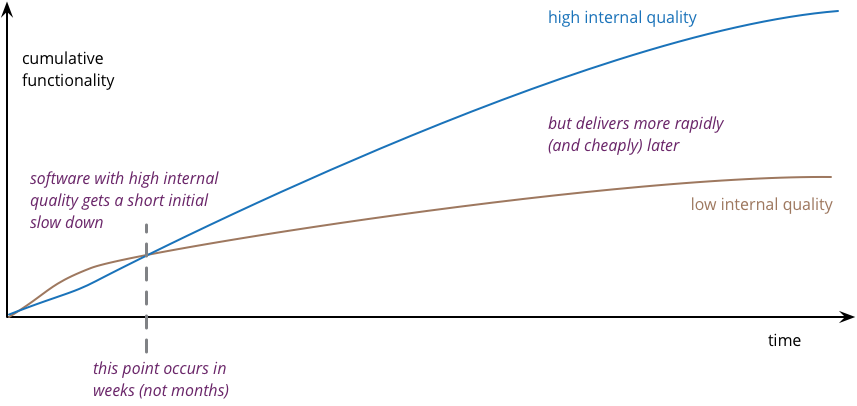

# Is High Quality Software Worth the Cost?

Source: <https://martinfowler.com/articles/is-quality-worth-cost.html>

The argument that settles the "we don't have time to do it properly" conversation: internal
quality is not a trade-off against speed, it *is* the mechanism of speed.

*Diagram by Martin Fowler, from the article linked above.*

High quality software is cheaper to produce. Summing all of this up:

- Neglecting internal quality leads to rapid build up of cruft
- This cruft slows down feature development
- Even a great team produces cruft, but by keeping internal quality high, is able to keep it under control
- High internal quality keeps cruft to a minimum, allowing a team to add features with less effort, time, and cost

The pay-off period is short — weeks, not years — which is why "we'll clean it up after the
deadline" rarely survives contact with the next deadline.
