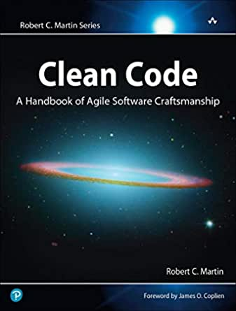

# Clean Code — reading notes

Notes taken while reading *Clean Code: A Handbook of Agile Software Craftsmanship* by
Robert C. Martin. **These are my notes on the book, not original writing** — the examples and
most of the phrasing are the author's.

  

> God is in the details.
> — Ludwig Mies van der Rohe

## Foreword: the 5S principles

The book opens by borrowing from lean manufacturing, and it is the frame the rest of it hangs on:

- **Organization (sort)** — knowing where things are is crucial.
- **Tidiness (systematize)** — a place for everything, and everything in its place.
- **Cleaning (shine)** — keep the workplace free of hanging wires, grease, scraps and waste.
- **Standardization** — do it the same way every time.
- **Discipline (self-discipline)** — the one that makes the other four survive a deadline.

Making your code readable is as important as making it executable.

## Chapters

Four chapters are written up. The rest I read but never summarised, so there is no file for
them — the full list is here as a map of the book, not as a promise.

| # | Chapter | |
| ---: | --- | --- |
| 1 | [Clean Code](01-clean-code.md) | why bad code sinks companies, and what "clean" means to nine well-known authors |
| 2 | [Meaningful Names](02-meaningful-names.md) | intention-revealing names; if a name needs a comment, it does not reveal intent |
| 3 | [Functions](03-functions.md) | small, then smaller; do one thing; the argument count that gives it away |
| 4 | [Comments](04-comments.md) | comments do not make up for bad code — explain yourself in code instead |
| 5 | Formatting | *not summarised* |
| 6 | Objects and Data Structures | *not summarised* |
| 7 | Error Handling | *not summarised* |
| 8 | Boundaries | *not summarised* |
| 9 | Unit Tests | *not summarised* |
| 10 | Classes | *not summarised* |
| 11 | Systems | *not summarised* |
| 12 | Emergence | *not summarised* |
| 13 | Concurrency | *not summarised* |
| 14 | Successive Refinement | *not summarised* |
| 15 | JUnit Internals | *not summarised* |
| 16 | Refactoring SerialDate | *not summarised* |
| 17 | Smells and Heuristics | *not summarised* |

The chapter that aged best is 4, on comments: it is the argument behind the rule I still
apply — a comment survives only if it explains **why**, never **what**.
